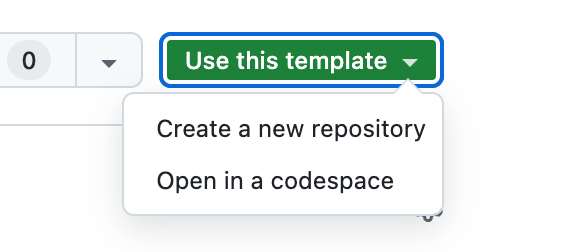
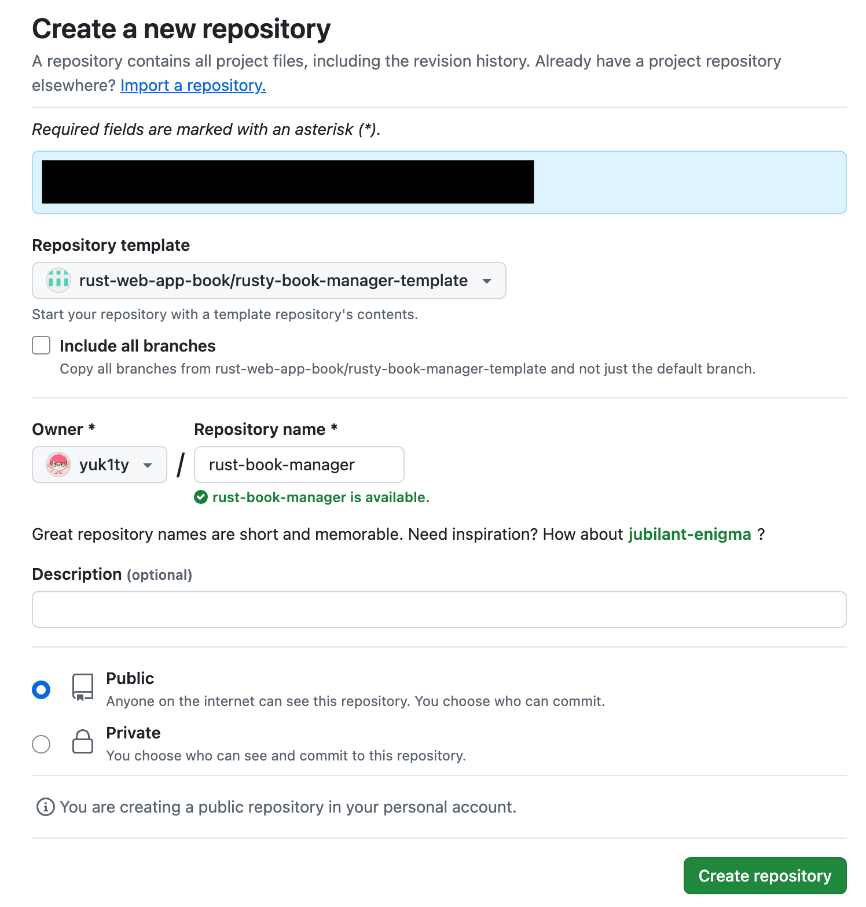

# rusty-book-manager-template

『Rust による Web アプリケーション開発』上の蔵書管理アプリケーションを実装するために便利なテンプレートリポジトリです。本書の開発を開始するにあたり、一通り必要な設定やファイルを揃えています。

このテンプレートリポジトリをお手元に clone することで、本書での開発をよりスムーズに進めることができます。このリポジトリを利用して開発を進めると、cargo-make に関する設定や Docker に関連する設定をショートカットすることができます。Rust のコードに集中して本書の理解を進めたい方はぜひ、このリポジトリをお手元に clone してください。

## 使い方

このリポジトリのページの右上にある「Use this repository」というボタンを押してください。ボタンを押下後、「Create a new repository」を選択します。

続いて、自身のリポジトリ名を入力し、リポジトリを作成します。手元にリポジトリが作成されたら、開発を開始することができます。

## テンプレートの内容

このテンプレートリポジトリには下記が含まれています。

- Dockerfile: Docker 向けの設定が書かれています。
- compose.yaml: docker compose を立ち上げるために必要です。
- Makefile.toml: cargo-make の設定のために必要です。
- rust-toolchain.toml: 書籍と Rust のバージョンをそろえるために必要です。
- .github: GitHub Actions の設定ファイルが主に含まれています。
- infra: AWS 上にリソースを構築し、デプロイやリリースを一通り体験したい場合に必要です。セットアップの方法については、[README](./infra/README.md)に記載しています。
- frontend: rust-book-manager の UI を立ち上げたい場合に必要です。立ち上げる方法は、[README](./frontend/README.md)に記載しています。
